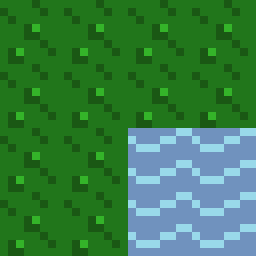
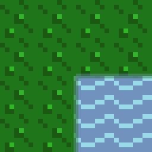

## Summary
This Electron app is for testing programmatically blending tiles together for easy transitions without the need to create additional art assets.

## Examples
Starting with the following image of tiles with hard edges:

Blends the tiles into the following image with faded edges:

## Development Setup
Install [Yarn](https://yarnpkg.com/en/).

#### Install Dependencies
Install project dependencies with:

<pre>
yarn add
</pre>

#### Run Locally
After project dependencies are installed, run locally with:

<pre>
yarn start
</pre>

#### Build
Build an application executable with:

<pre>
yarn dist
</pre>
